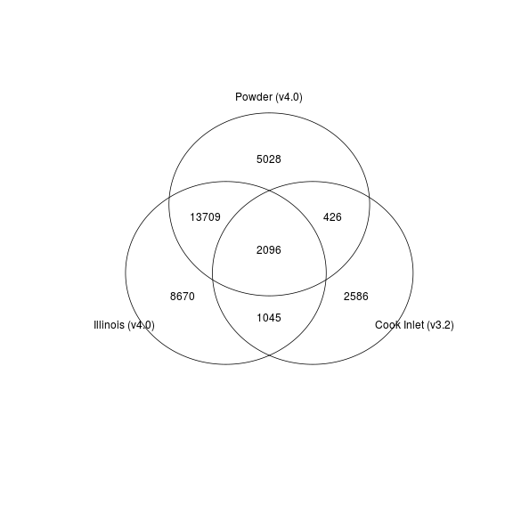

<!-- rmarkdown v1 -->
Exploring Overlap
=================================================
This report looks explores the overlap of genes between basins

<!--  Set the working directory to the repository's base directory; this assumes the report is nested inside of two directories.-->


<!-- Set the report-wide options, and point to the external code file. -->

<!-- Load the packages.  Suppress the output when loading packages. --> 

```r
requireNamespace("dplyr")
requireNamespace("plyr")
requireNamespace("scales") #For formating values in graphs
requireNamespace("RColorBrewer")
requireNamespace("grid") #For graphing
requireNamespace("gplots") #For graphing
library(ggplot2) #For graphing
library(magrittr)
# library(mgcv, quietly=TRUE) #For the Generalized Additive Model that smooths the longitudinal graphs.
#####################################
```

<!-- Load any Global functions and variables declared in the R file.  Suppress the output. --> 

```r
options(show.signif.stars=F) #Turn off the annotations on p-values

pathInputLong <- "./Data/Derived/Unpacked.csv"
# pathInputWide <- "./Data/Derived/AllBasinsWide.csv"

basinOrder <- c("Illinois", "CookInlet", "Powder")
geochipBasinVersion <- c("CookInlet"=3.2,  "Illinois"=4.0, "Powder"=4.0)

ReportTheme <- theme_bw() +
  theme(axis.ticks.length = grid::unit(0, "cm")) +
  theme(axis.text = element_text(color="gray40")) +
  theme(axis.title = element_text(color="gray40")) +
  theme(panel.border = element_rect(color="gray80")) +
  theme(axis.ticks = element_line(color="gray80")) +
  theme(strip.background=element_rect(color=NA, fill="gray95"))

#####################################
```

<!-- Declare any global functions specific to a Rmd output.  Suppress the output. --> 


<!-- Load the datasets.   -->

```r
# 'ds' stands for 'datasets'
dsLong <- read.csv(pathInputLong, stringsAsFactors=FALSE)

# sapply(dsLong, class)

#####################################
```

<!-- Tweak the datasets.   -->

```r
# a <- as.integer(dsLong$GenbankID)
# dsLong$GenbankID[is.na(a)]
# dsLong$GenbankID <- as.integer(dsLong$GenbankID)

dsLong$GeochipVersion <- as.numeric(plyr::revalue(dsLong$Basin, replace=geochipBasinVersion))

#Reorder the substrates and basins.  The default alphabetical order isn't the most intuitive
dsLong$Basin <- factor(dsLong$Basin, levels=basinOrder)

dsLongV32 <- dsLong[dsLong$GeochipVersion==3.2, ]
dsLongV40 <- dsLong[dsLong$GeochipVersion==4.0, ]

dsLong$IsV32 <- (dsLong$GeochipVersion==3.2)

dsLongBasinUnique <- dsLong %>%
  dplyr::group_by(GenbankID, GeneCategory, Basin) %>%
  dplyr::summarize(
    PositiveProbeCount = n()
  )
  
table(dsLong$Basin)
```

```

 Illinois CookInlet    Powder 
   382800     18991     85032 
```

```r
vennList <- list(
  "Illinois\n(4.0)" = dsLongBasinUnique[dsLongBasinUnique$Basin=="Illinois", ]$GenbankID,
  "Cook Inlet\n(3.2)" = dsLongBasinUnique[dsLongBasinUnique$Basin=="CookInlet", ]$GenbankID,
  "Powder\n(4.0)" = dsLongBasinUnique[dsLongBasinUnique$Basin=="Powder", ]$GenbankID
)
# dsLong$Basin
#####################################
```

# Calculate Overlap

```r
dsLong %>%
  dplyr::group_by(GeochipVersion) %>%
  dplyr::summarize(
    Count = n()
  )
```

```
Source: local data frame [2 x 2]

  GeochipVersion  Count
1            3.2  18991
2            4.0 467832
```

```r
setdiff(x=1:9, y=c(1,4,5))
```

```
[1] 2 3 6 7 8 9
```

```r
intersect(x=1:9, y=c(0,1,4,5))
```

```
[1] 1 4 5
```

```r
commonGenbankIDs <- intersect(dsLongV32$GenbankID, dsLongV40$GenbankID)
length(commonGenbankIDs)
```

```
[1] 3566
```

```r
print(
  dsLong %>%
    dplyr::group_by(GeneCategory, GeochipVersion) %>%
    dplyr::summarize(
      Count = n()
    )
  , n=40
)
```

```
Source: local data frame [27 x 3]
Groups: GeneCategory

            GeneCategory GeochipVersion  Count
1  Antibiotic resistance            3.2   1038
2  Antibiotic resistance            4.0  17479
3         Bacteria phage            4.0   2862
4            Bioleaching            4.0   2952
5         Carbon cycling            3.2   2814
6         Carbon cycling            4.0  60046
7         Energy process            3.2    365
8         Energy process            4.0   5318
9       Metal Resistance            3.2   3735
10      Metal Resistance            4.0  57384
11    Methane Production            3.2     47
12    Methane Production            4.0   1203
13               Missing            3.2    293
14              Nitrogen            3.2   2118
15              Nitrogen            4.0  40909
16   Organic Remediation            3.2   6737
17   Organic Remediation            4.0 120595
18            Phosphorus            3.2    432
19            Phosphorus            4.0   7560
20                Stress            4.0 105907
21     Sulfate Reduction            3.2    794
22     Sulfate Reduction            4.0  13223
23      Sulfur Oxidation            3.2    186
24      Sulfur Oxidation            4.0   3191
25        other category            3.2    432
26        other category            4.0  10360
27             virulence            4.0  18843
```

```r
dsLong %>%
  dplyr::group_by(GeneCategory) %>%
  dplyr::summarize(
    CountTotal = scales::comma(length(IsV32)),
    CountV32 = scales::comma(sum(IsV32)),
    CountV40 = scales::comma(sum(!IsV32))
  )
```

```
Source: local data frame [16 x 4]

            GeneCategory CountTotal CountV32 CountV40
1  Antibiotic resistance     18,517    1,038   17,479
2         Bacteria phage      2,862        0    2,862
3            Bioleaching      2,952        0    2,952
4         Carbon cycling     62,860    2,814   60,046
5         Energy process      5,683      365    5,318
6       Metal Resistance     61,119    3,735   57,384
7     Methane Production      1,250       47    1,203
8                Missing        293      293        0
9               Nitrogen     43,027    2,118   40,909
10   Organic Remediation    127,332    6,737  120,595
11            Phosphorus      7,992      432    7,560
12                Stress    105,907        0  105,907
13     Sulfate Reduction     14,017      794   13,223
14      Sulfur Oxidation      3,377      186    3,191
15        other category     10,792      432   10,360
16             virulence     18,843        0   18,843
```

```r
dsLongBasinProbeCount <- dsLongBasinUnique %>%
  dplyr::group_by(GeneCategory) %>%
  dplyr::summarize(
    Total = scales::comma(length(Basin)),
    Illinois = scales::comma(sum(Basin=="Illinois")),
    CookInlet = scales::comma(sum(Basin=="CookInlet")),
    Powder = scales::comma(sum(Basin=="Powder"))
  )
dsLongBasinProbeCount
```

```
Source: local data frame [16 x 5]

            GeneCategory  Total Illinois CookInlet Powder
1  Antibiotic resistance  2,117      945       346    826
2         Bacteria phage    314      146         0    168
3            Bioleaching    309      156         0    153
4         Carbon cycling  6,943    3,266       913  2,764
5         Energy process    645      290       113    242
6       Metal Resistance  6,946    3,128     1,202  2,616
7     Methane Production    130       69        19     42
8                Missing     96        0        96      0
9               Nitrogen  4,842    2,219       717  1,906
10   Organic Remediation 13,966    6,665     2,146  5,155
11            Phosphorus    892      412       135    345
12                Stress 10,689    5,741         0  4,948
13     Sulfate Reduction  1,562      729       261    572
14      Sulfur Oxidation    369      177        58    134
15        other category  1,201      560       151    490
16             virulence  1,914    1,017         0    897
```

```r
#####################################
```

# Venn Diagrams
 

# Questions
## Unanswered Questions
 1. - - - 
 
## Answered Questions
 1. - - - 
 
# Session Information
For the sake of documentation and reproducibility, the current report was build on a system using the following software.


```
Report created by Will at 2015-07-03, 14:45 -0500
```

```
R version 3.2.1 Patched (2015-06-18 r68542)
Platform: x86_64-w64-mingw32/x64 (64-bit)
Running under: Windows 8 x64 (build 9200)

locale:
[1] LC_COLLATE=English_United States.1252  LC_CTYPE=English_United States.1252    LC_MONETARY=English_United States.1252
[4] LC_NUMERIC=C                           LC_TIME=English_United States.1252    

attached base packages:
[1] stats     graphics  grDevices utils     datasets  methods   base     

other attached packages:
[1] magrittr_1.5  ggplot2_1.0.1 knitr_1.10.5 

loaded via a namespace (and not attached):
 [1] Rcpp_0.11.6        MASS_7.3-41        munsell_0.4.2      colorspace_1.2-6   R6_2.0.1           stringr_1.0.0     
 [7] plyr_1.8.3         dplyr_0.4.2        caTools_1.17.1     tools_3.2.1        parallel_3.2.1     grid_3.2.1        
[13] gtable_0.1.2       KernSmooth_2.23-14 DBI_0.3.1          gtools_3.5.0       lazyeval_0.1.10    assertthat_0.1    
[19] digest_0.6.8       reshape2_1.4.1     RColorBrewer_1.1-2 formatR_1.2        bitops_1.0-6       evaluate_0.7      
[25] gdata_2.16.1       stringi_0.5-5      gplots_2.17.0      scales_0.2.5       proto_0.3-10      
```
