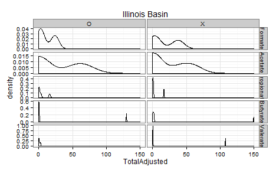

IllinoisSemCorrelations
=================================================
This report takes an SEM approach to fitting the Illinois Basin replicates

<!--  Set the working directory to the repository's base directory; this assumes the report is nested inside of two directories.-->


<!-- Set the report-wide options, and point to the external code file. -->

<!-- Load the packages.  Suppress the output when loading packages. --> 

```r
# require(xtable)
require(knitr)
require(plyr)
# require(scales) #For formating values in graphs
require(RColorBrewer)
require(ggplot2) #For graphing
# require(lavaan) #For graphing
# require(OpenMx) #For graphing
# require(mgcv, quietly=TRUE) #For the Generalized Additive Model that smooths the longitudinal graphs.
#####################################
```

<!-- Load any Global functions and variables declared in the R file.  Suppress the output. --> 

```r
options(show.signif.stars=F) #Turn off the annotations on p-values
options(stringsAsFactors=FALSE) #By default, character/string variables will NOT be automatically converted to factors.

pathInputLong <- "./Data/Derived/AllBasinsLong.csv"
pathInputWide <- "./Data/Derived/AllBasinsWide.csv"

substrateOrder <- c("Formate", "Acetate", "Propionate", "Butyrate", "Valerate")
sitesToDrop <- c(7, 16, 17)

#####################################
```

<!-- Declare any global functions specific to a Rmd output.  Suppress the output. --> 


<!-- Load the datasets.   -->

```r
# 'ds' stands for 'datasets'
dsLong <- read.csv(pathInputLong)
dsWide <- read.csv(pathInputWide)
# sapply(dsWide, class)

#####################################
```

<!-- Tweak the datasets.   -->

```r
#Drop the sites without microarray data
dsLong <- dsLong[!(dsLong$Site %in% sitesToDrop), ]
dsWide <- dsWide[!(dsWide$Site %in% sitesToDrop), ]

dsLong$Substrate <- factor(dsLong$Substrate, levels=substrateOrder)
dsWide$Substrate <- factor(dsWide$Substrate, levels=substrateOrder)

dsLongIllinois <- dsLong[dsLong$Basin=="Illinois Basin", ]
dsWideIllinois <- dsWide[dsWide$Basin=="Illinois Basin", ]

# dsWide <- dsWide[dsWide$Substrate == "Formate", ]
# dsWide <- dsWide[dsWide$Substrate == "Acetate", ]
# dsWide <- dsWide[dsWide$Substrate == "Propionate", ]
# dsWide <- dsWide[dsWide$Substrate == "Butyrate", ]
# dsWide <- dsWide[dsWide$Substrate == "Valerate", ] 

#####################################
```

## Notes


# Marginals

```r
ggplot(dsLongIllinois, aes(x=AdjustedRate)) + 
  geom_density() +
  facet_grid(Substrate~IncubationReplicate, scales="free_y") +
  theme_bw() +
  labs(title="Illinois Basin")
```

 

```r
ggplot(dsLongIllinois, aes(x=QuantityMcrGenes)) + 
  geom_density() +
  facet_grid(Substrate~MicroarraryReplicate, scales="free_y") +
  theme_bw() +
  labs(title="Illinois Basin")
```

 

```r
ggplot(dsLongIllinois, aes(x=UniqueMcrGenes)) + 
  geom_density() +
  facet_grid(Substrate~MicroarraryReplicate, scales="free_y") +
  theme_bw() +
  labs(title="Illinois Basin")
```

 

```r
#####################################
```

# Models

```r
# manifests <- c("QuantityZ1", "QuantityZ2", "QuantityZ3")
# manifests <- c("Quantity1", "Quantity2", "Quantity3")
# latents <- c("Quantity")
# factorModel <- mxModel("One Factor",
#                        type="RAM",
#                        manifestVars = manifests,
#                        latentVars = latents,
#                        mxPath(from=latents, to=manifests),
#                        mxPath(from=manifests, arrows=2),
#                        mxPath(from=latents, arrows=2,
#                               free=FALSE, values=1.0),
#                        mxPath(from="one", to=manifests, arrows=1, free=T),
#                        mxData(dsWide[, manifests], type="raw",
#                               numObs=nrow(dsWide)))
# summary(mxRun(factorModel))
# 
# cor(dsWide[,  c("QuantityZ1", "QuantityZ2", "QuantityZ3")])
# cor(dsWide[,  c("Quantity1", "Quantity2", "Quantity3")])

#  model <- "
#   # measurement model
# #   Rate =~ 1*RateZ1 + 1*RateZ2
# #   Rate =~ 1*Rate1 + 1*Rate2
#   Quantity =~ 1*QuantityZ1 + 1*QuantityZ2 + 1*QuantityZ3
# #   Quantity =~ q*Quantity1 + q*Quantity2 + q*Quantity3
#   Rate =~ RateZ1 
# #   Quantity =~ QuantityZ1 
#   
#   # regressions
#   Rate ~ Quantity
# 
#   # fix variances of factors
#     Rate ~~ 1*Rate
#     Quantity ~~ 1*Quantity
# "
# 
# for( substrate in substrateOrder ) {
#   cat("============ ", substrate, " ==============\n")
#   dsSubstrate <- dsWide[dsWide$Substrate==substrate, ]
#   fit <- sem(model, data = dsSubstrate)
#   summary(fit, standardized = FALSE)
# }
# # fit <- sem(model, data = dsWide)
# # summary(fit, standardized = FALSE)
```

# Questions
## Unanswered Questions
 1. - - - 
 
## Answered Questions
 1. - - - 
 
# Session Information
For the sake of documentation and reproducibility, the current report was build on a system using the following software.


```
Report created by Will at 2014-06-18, 14:17 -0500
```

```
R version 3.1.0 Patched (2014-06-15 r65949)
Platform: x86_64-w64-mingw32/x64 (64-bit)

locale:
[1] LC_COLLATE=English_United States.1252  LC_CTYPE=English_United States.1252    LC_MONETARY=English_United States.1252
[4] LC_NUMERIC=C                           LC_TIME=English_United States.1252    

attached base packages:
[1] stats     graphics  grDevices utils     datasets  methods   base     

other attached packages:
[1] ggplot2_1.0.0      RColorBrewer_1.0-5 plyr_1.8.1         knitr_1.6         

loaded via a namespace (and not attached):
 [1] colorspace_1.2-4 digest_0.6.4     evaluate_0.5.5   formatR_0.10     grid_3.1.0       gtable_0.1.2    
 [7] labeling_0.2     MASS_7.3-33      munsell_0.4.2    proto_0.3-10     Rcpp_0.11.2      reshape2_1.4    
[13] scales_0.2.4     stringr_0.6.2    tools_3.1.0     
```
