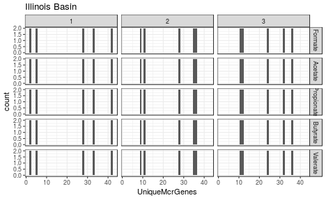

<!-- rmarkdown v1 -->
IllinoisSemCorrelations
=================================================
This report takes an SEM approach to fitting the Illinois Basin replicates

<!--  Set the working directory to the repository's base directory; this assumes the report is nested inside of two directories.-->


<!-- Set the report-wide options, and point to the external code file. -->

<!-- Load the packages.  Suppress the output when loading packages. --> 

```r
# library(xtable)
library(knitr)
library(plyr)
# library(scales) #For formating values in graphs
library(RColorBrewer)
library(ggplot2) #For graphing
library(lavaan) #For graphing
# library(OpenMx) #For graphing
# library(mgcv, quietly=TRUE) #For the Generalized Additive Model that smooths the longitudinal graphs.
#####################################
```

<!-- Load any Global functions and variables declared in the R file.  Suppress the output. --> 

```r
options(show.signif.stars=F) #Turn off the annotations on p-values
options(stringsAsFactors=FALSE) #By default, character/string variables will NOT be automatically converted to factors.

pathInputLong <- "./Data/Derived/AllBasinsLong.csv"
pathInputWide <- "./Data/Derived/AllBasinsWide.csv"

substrateOrder <- c("Formate", "Acetate", "Propionate", "Butyrate", "Valerate")
sitesToDrop <- c(7, 16, 17)

#####################################
```

<!-- Declare any global functions specific to a Rmd output.  Suppress the output. --> 


<!-- Load the datasets.   -->

```r
# 'ds' stands for 'datasets'
dsLong <- read.csv(pathInputLong)
dsWide <- read.csv(pathInputWide)
# sapply(dsWide, class)

#####################################
```

<!-- Tweak the datasets.   -->

```r
#Drop the sites without microarray data
dsLong <- dsLong[!(dsLong$Site %in% sitesToDrop), ]
dsWide <- dsWide[!(dsWide$Site %in% sitesToDrop), ]

dsLong$Substrate <- factor(dsLong$Substrate, levels=substrateOrder)
dsWide$Substrate <- factor(dsWide$Substrate, levels=substrateOrder)

dsLongIllinois <- dsLong[dsLong$Basin=="Illinois Basin", ]
dsWideIllinois <- dsWide[dsWide$Basin=="Illinois Basin", ]

# dsWide <- dsWide[dsWide$Substrate == "Formate", ]
# dsWide <- dsWide[dsWide$Substrate == "Acetate", ]
# dsWide <- dsWide[dsWide$Substrate == "Propionate", ]
# dsWide <- dsWide[dsWide$Substrate == "Butyrate", ]
# dsWide <- dsWide[dsWide$Substrate == "Valerate", ] 

#####################################
```

## Notes


# Marginals

```r
ggplot(dsLongIllinois, aes(x=TotalAdjusted)) + 
  geom_density() +
  facet_grid(Substrate~IncubationReplicate, scales="free_y") +
  theme_bw() +
  labs(title="Illinois Basin")
```

 

```r
ggplot(dsLongIllinois, aes(x=QuantityMcrGenes)) + 
  geom_density() +
  facet_grid(Substrate~MicroarraryReplicate, scales="free_y") +
  theme_bw() +
  labs(title="Illinois Basin")
```

 

```r
ggplot(dsLongIllinois, aes(x=UniqueMcrGenes)) + 
  geom_density() +
  facet_grid(Substrate~MicroarraryReplicate, scales="free_y") +
  theme_bw() +
  labs(title="Illinois Basin")
```

 

```r
#####################################
```

# Models

```r
# manifests <- c("QuantityZ1", "QuantityZ2", "QuantityZ3")
# manifests <- c("Quantity1", "Quantity2", "Quantity3")
# latents <- c("Quantity")
# factorModel <- mxModel("One Factor",
#                        type="RAM",
#                        manifestVars = manifests,
#                        latentVars = latents,
#                        mxPath(from=latents, to=manifests),
#                        mxPath(from=manifests, arrows=2),
#                        mxPath(from=latents, arrows=2,
#                               free=FALSE, values=1.0),
#                        mxPath(from="one", to=manifests, arrows=1, free=T),
#                        mxData(dsWide[, manifests], type="raw",
#                               numObs=nrow(dsWide)))
# summary(mxRun(factorModel))
# 
# cor(dsWide[,  c("QuantityZ1", "QuantityZ2", "QuantityZ3")])
# cor(dsWide[,  c("Quantity1", "Quantity2", "Quantity3")])

model <- "
  # measurement model
#   Rate =~ 1*RateZ1 + 1*RateZ2
#   Rate =~ 1*Rate1 + 1*Rate2
#   Quantity =~ 1*QuantityZ1 + 1*QuantityZ2 + 1*QuantityZ3
#   Quantity =~ q*Quantity1 + q*Quantity2 + q*Quantity3
#   Rate =~ RateZ1 
  Quantity =~ QuantityZ1 
#   Total =~ TotalAdjusted1
  Total =~ 1*TotalAdjusted1 + 1*TotalAdjusted2
  
  # regressions
#   Rate ~ Quantity
  Total ~ Quantity

  # fix variances of factors
#     Rate ~~ 1*Rate
    Total ~~ 1*Total
    Quantity ~~ 1*Quantity
"
# substrateOrder <- c("Formate")
for( substrate in substrateOrder ) {
  cat("============ ", substrate, " ==============\n")
  dsSubstrate <- dsWide[dsWide$Substrate==substrate, ]
  fit <- sem(model, data = dsSubstrate)
  summary(fit, standardized = FALSE)
}
```

```
============  Formate  ==============
lavaan (0.5-17) converged normally after  20 iterations

  Number of observations                            14

  Estimator                                         ML
  Minimum Function Test Statistic                6.012
  Degrees of freedom                                 3
  P-value (Chi-square)                           0.111

Parameter estimates:

  Information                                 Expected
  Standard Errors                             Standard

                   Estimate  Std.err  Z-value  P(>|z|)
Latent variables:
  Quantity =~
    QuantityZ1        1.000
  Total =~
    TotalAdjustd1     1.000
    TotalAdjustd2     1.000

Regressions:
  Total ~
    Quantity          0.501    2.750    0.182    0.856

Variances:
    Total             1.000
    Quantity          1.000
    QuantityZ1        0.000
    TotalAdjustd1   146.755   55.845
    TotalAdjustd2   367.132  139.138

============  Acetate  ==============
```

```
Warning in lav_data_full(data = data, group = group, group.label = group.label, : lavaan WARNING: some observed
variances are (at least) a factor 1000 times larger than others; use varTable(fit) to investigate
```

```
lavaan (0.5-17) converged normally after  21 iterations

  Number of observations                            14

  Estimator                                         ML
  Minimum Function Test Statistic                7.081
  Degrees of freedom                                 3
  P-value (Chi-square)                           0.069

Parameter estimates:

  Information                                 Expected
  Standard Errors                             Standard

                   Estimate  Std.err  Z-value  P(>|z|)
Latent variables:
  Quantity =~
    QuantityZ1        1.000
  Total =~
    TotalAdjustd1     1.000
    TotalAdjustd2     1.000

Regressions:
  Total ~
    Quantity         -2.261    6.029   -0.375    0.708

Variances:
    Total             1.000
    Quantity          1.000
    QuantityZ1        0.000
    TotalAdjustd1   844.696  319.643
    TotalAdjustd2  1273.807  481.831

============  Propionate  ==============
```

```
Warning in lav_data_full(data = data, group = group, group.label = group.label, : lavaan WARNING: some observed
variances are (at least) a factor 1000 times larger than others; use varTable(fit) to investigate
```

```
lavaan (0.5-17) converged normally after  21 iterations

  Number of observations                            14

  Estimator                                         ML
  Minimum Function Test Statistic               49.296
  Degrees of freedom                                 3
  P-value (Chi-square)                           0.000

Parameter estimates:

  Information                                 Expected
  Standard Errors                             Standard

                   Estimate  Std.err  Z-value  P(>|z|)
Latent variables:
  Quantity =~
    QuantityZ1        1.000
  Total =~
    TotalAdjustd1     1.000
    TotalAdjustd2     1.000

Regressions:
  Total ~
    Quantity         -3.574    8.212   -0.435    0.663

Variances:
    Total             1.000
    Quantity          1.000
    QuantityZ1        0.000
    TotalAdjustd1  1639.293  619.972
    TotalAdjustd2  2221.191  839.909

============  Butyrate  ==============
```

```
Warning in lav_data_full(data = data, group = group, group.label = group.label, : lavaan WARNING: some observed
variances are (at least) a factor 1000 times larger than others; use varTable(fit) to investigate
```

```
lavaan (0.5-17) converged normally after  21 iterations

  Number of observations                            14

  Estimator                                         ML
  Minimum Function Test Statistic               26.722
  Degrees of freedom                                 3
  P-value (Chi-square)                           0.000

Parameter estimates:

  Information                                 Expected
  Standard Errors                             Standard

                   Estimate  Std.err  Z-value  P(>|z|)
Latent variables:
  Quantity =~
    QuantityZ1        1.000
  Total =~
    TotalAdjustd1     1.000
    TotalAdjustd2     1.000

Regressions:
  Total ~
    Quantity        -12.653   12.707   -0.996    0.319

Variances:
    Total             1.000
    Quantity          1.000
    QuantityZ1        0.000
    TotalAdjustd1  4369.617 1651.938
    TotalAdjustd2  4679.467 1769.050

============  Valerate  ==============
```

```
Warning in lav_data_full(data = data, group = group, group.label = group.label, : lavaan WARNING: some observed
variances are (at least) a factor 1000 times larger than others; use varTable(fit) to investigate
```

```
lavaan (0.5-17) converged normally after  22 iterations

  Number of observations                            14

  Estimator                                         ML
  Minimum Function Test Statistic               23.899
  Degrees of freedom                                 3
  P-value (Chi-square)                           0.000

Parameter estimates:

  Information                                 Expected
  Standard Errors                             Standard

                   Estimate  Std.err  Z-value  P(>|z|)
Latent variables:
  Quantity =~
    QuantityZ1        1.000
  Total =~
    TotalAdjustd1     1.000
    TotalAdjustd2     1.000

Regressions:
  Total ~
    Quantity        -12.832   14.149   -0.907    0.364

Variances:
    Total             1.000
    Quantity          1.000
    QuantityZ1        0.000
    TotalAdjustd1  4632.955 1751.470
    TotalAdjustd2  7088.595 2679.615
```

```r
# # fit <- sem(model, data = dsWide)
# # summary(fit, standardized = FALSE)
```

# Questions
## Unanswered Questions
 1. - - - 
 
## Answered Questions
 1. - - - 
 
# Session Information
For the sake of documentation and reproducibility, the current report was build on a system using the following software.


```
Report created by Will at 2014-12-18, 10:06 -0600
```

```
R version 3.1.2 Patched (2014-12-11 r67168)
Platform: x86_64-w64-mingw32/x64 (64-bit)

locale:
[1] LC_COLLATE=English_United States.1252  LC_CTYPE=English_United States.1252    LC_MONETARY=English_United States.1252
[4] LC_NUMERIC=C                           LC_TIME=English_United States.1252    

attached base packages:
[1] stats     graphics  grDevices utils     datasets  methods   base     

other attached packages:
[1] lavaan_0.5-17      ggplot2_1.0.0      RColorBrewer_1.1-2 plyr_1.8.1         knitr_1.8         

loaded via a namespace (and not attached):
 [1] colorspace_1.2-4 digest_0.6.6     evaluate_0.5.5   formatR_1.0      grid_3.1.2       gtable_0.1.2    
 [7] labeling_0.3     MASS_7.3-35      mnormt_1.5-1     munsell_0.4.2    pbivnorm_0.5-1   proto_0.3-10    
[13] quadprog_1.5-5   Rcpp_0.11.3      reshape2_1.4.1   scales_0.2.4     stats4_3.1.2     stringr_0.6.2   
[19] tools_3.1.2     
```
