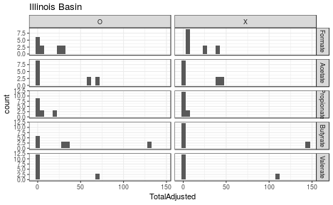
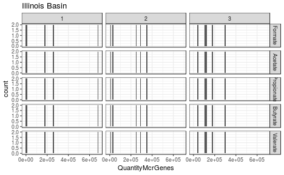

<!-- rmarkdown v1 -->
IllinoisSemCorrelations
=================================================
This report takes an SEM approach to fitting the Illinois Basin replicates

<!--  Set the working directory to the repository's base directory; this assumes the report is nested inside of two directories.-->


<!-- Set the report-wide options, and point to the external code file. -->

<!-- Load the packages.  Suppress the output when loading packages. --> 

```r
# library(xtable)
library(knitr)
# library(plyr)
# library(scales) #For formating values in graphs
library(RColorBrewer)
library(ggplot2) #For graphing
library(lavaan) #For graphing
# library(OpenMx) #For graphing
# library(mgcv, quietly=TRUE) #For the Generalized Additive Model that smooths the longitudinal graphs.
#####################################
```

<!-- Load any Global functions and variables declared in the R file.  Suppress the output. --> 

```r
options(show.signif.stars=F) #Turn off the annotations on p-values

pathInputLong <- "./Data/Derived/AllBasinsLong.csv"
pathInputWide <- "./Data/Derived/AllBasinsWide.csv"

substrateOrder <- c("Formate", "Acetate", "Propionate", "Butyrate", "Valerate")
sitesToDrop <- c(7, 16, 17)

#####################################
```

<!-- Declare any global functions specific to a Rmd output.  Suppress the output. --> 


<!-- Load the datasets.   -->

```r
# 'ds' stands for 'datasets'
dsLong <- read.csv(pathInputLong, stringsAsFactors=FALSE)
dsWide <- read.csv(pathInputWide, stringsAsFactors=FALSE)
# sapply(dsWide, class)

#####################################
```

<!-- Tweak the datasets.   -->

```r
dsWide$Quantity1 <- dsWide$Quantity1 / 10000
dsWide$Quantity2 <- dsWide$Quantity2 / 10000
dsWide$Quantity3 <- dsWide$Quantity3 / 10000

#Drop the sites without microarray data
dsLong <- dsLong[!(dsLong$Site %in% sitesToDrop), ]
dsWide <- dsWide[!(dsWide$Site %in% sitesToDrop), ]

dsLong$Substrate <- factor(dsLong$Substrate, levels=substrateOrder)
dsWide$Substrate <- factor(dsWide$Substrate, levels=substrateOrder)

dsLongIllinois <- dsLong[dsLong$Basin=="Illinois Basin", ]
dsWideIllinois <- dsWide[dsWide$Basin=="Illinois Basin", ]

# dsWide <- dsWide[dsWide$Substrate == "Formate", ]
# dsWide <- dsWide[dsWide$Substrate == "Acetate", ]
# dsWide <- dsWide[dsWide$Substrate == "Propionate", ]
# dsWide <- dsWide[dsWide$Substrate == "Butyrate", ]
# dsWide <- dsWide[dsWide$Substrate == "Valerate", ] 

#####################################
```

## Notes


# Marginals

```r
ggplot(dsLongIllinois, aes(x=TotalAdjusted)) + 
  geom_histogram(binwidth=5) +
  facet_grid(Substrate~IncubationReplicate, scales="free_y") +
  theme_bw() +
  labs(title="Illinois Basin")
```



```r
ggplot(dsLongIllinois, aes(x=QuantityMcrGenes)) + 
  geom_histogram(binwidth=10000) +
  facet_grid(Substrate~MicroarraryReplicate, scales="free_y") +
  theme_bw() +
  labs(title="Illinois Basin")
```



```r
ggplot(dsLongIllinois, aes(x=UniqueMcrGenes)) + 
  geom_histogram(binwidth=1) +
  facet_grid(Substrate~MicroarraryReplicate, scales="free_y") +
  theme_bw() +
  labs(title="Illinois Basin")
```


```r
#####################################
```

# Models

```r
# manifests <- c("QuantityZ1", "QuantityZ2", "QuantityZ3")
# manifests <- c("Quantity1", "Quantity2", "Quantity3")
# latents <- c("Quantity")
# factorModel <- mxModel("One Factor",
#                        type="RAM",
#                        manifestVars = manifests,
#                        latentVars = latents,
#                        mxPath(from=latents, to=manifests),
#                        mxPath(from=manifests, arrows=2),
#                        mxPath(from=latents, arrows=2,
#                               free=FALSE, values=1.0),
#                        mxPath(from="one", to=manifests, arrows=1, free=T),
#                        mxData(dsWide[, manifests], type="raw",
#                               numObs=nrow(dsWide)))
# summary(mxRun(factorModel))
# 
# cor(dsWide[,  c("QuantityZ1", "QuantityZ2", "QuantityZ3")])
# cor(dsWide[,  c("Quantity1", "Quantity2", "Quantity3")])

model <- "
  # measurement model
#   Rate =~ 1*RateZ1 + 1*RateZ2
#   Rate =~ 1*Rate1 + 1*Rate2
#   Quantity =~ 1*QuantityZ1 + 1*QuantityZ2 + 1*QuantityZ3
  Quantity =~ 1*Quantity1 + 1*Quantity2 + 1*Quantity3
#   Quantity =~ q*Quantity1 + q*Quantity2 + q*Quantity3
#   Rate =~ RateZ1 
#   Quantity =~ QuantityZ1 
#   Total =~ TotalAdjusted1
#   Total =~ TotalAdjusted2
  Total =~ 1*TotalAdjusted2
#   Total =~ 1*TotalAdjusted1 + 1*TotalAdjusted2
#   Total =~ t*TotalAdjusted1 + t*TotalAdjusted2
  
  # regressions
#   Rate ~ Quantity
  Total ~ Quantity

  # fix variances of factors
#     Rate ~~ 1*Rate
    Total ~~ vT*Total
    Quantity ~~ vQ*Quantity
"
# substrateOrder <- c("Formate")
# for( substrate in substrateOrder ) {
#   cat("============ ", substrate, " ==============\n")
#   dsSubstrate <- dsWide[dsWide$Substrate==substrate & dsWide$Basin=="Illinois Basin", ]
#   fit <- sem(model, data = dsSubstrate)
#   summary(fit, standardized = FALSE)
# }

dsSubstrate <- dsWide[dsWide$Substrate=="Formate" & dsWide$Basin=="Illinois Basin", ]
  fit <- sem(model, data = dsSubstrate)
  summary(fit, standardized = FALSE)
```

```
lavaan (0.5-22) converged normally after  42 iterations

  Number of observations                             5

  Estimator                                         ML
  Minimum Function Test Statistic               14.116
  Degrees of freedom                                 4
  P-value (Chi-square)                           0.007

Parameter Estimates:

  Information                                 Expected
  Standard Errors                             Standard

Latent Variables:
                   Estimate  Std.Err  z-value  P(>|z|)
  Quantity =~                                         
    Quantity1         1.000                           
    Quantity2         1.000                           
    Quantity3         1.000                           
  Total =~                                            
    TotalAdjusted2    1.000                           

Regressions:
                   Estimate  Std.Err  z-value  P(>|z|)
  Total ~                                             
    Quantity        -10.040  180.157   -0.056    0.956

Variances:
                   Estimate  Std.Err  z-value  P(>|z|)
   .Total     (vT)    1.109 4370.152    0.000    1.000
    Quantity  (vQ)    2.431   44.423    0.055    0.956
   .Quantity1       607.774  386.832    1.571    0.116
   .Quantity2       194.962  130.707    1.492    0.136
   .Quantity3        69.143   61.581    1.123    0.262
   .TtlAdjst2         0.000                           
```

```r
varTable(fit)
```

```
            name idx nobs    type exo user   mean     var nlev lnam
1      Quantity1  11    5 numeric   0    0 22.588 777.071    0     
2      Quantity2  12    5 numeric   0    0 18.506 240.312    0     
3      Quantity3  13    5 numeric   0    0 15.103  90.119    0     
4 TotalAdjusted2   5    5 numeric   0    0 15.406 307.627    0     
```

```r
inspect(fit,"theta")
```

```
               Qntty1  Qntty2  Qntty3  TtlAd2 
Quantity1      607.774                        
Quantity2        0.000 194.962                
Quantity3        0.000   0.000  69.143        
TotalAdjusted2   0.000   0.000   0.000   0.000
```

```r
cor(dsSubstrate$TotalAdjusted1, dsSubstrate$TotalAdjusted2)
```

```
[1] 0.8814653
```

```r
M <- cor(dsSubstrate[, c("TotalAdjusted1", "TotalAdjusted2", "Quantity1", "Quantity2", "Quantity3")])
corrplot::corrplot(M, addCoef.col = "black")
```


```r
# # fit <- sem(model, data = dsWide)
# # summary(fit, standardized = FALSE)
```

# Questions
## Unanswered Questions
 1. - - - 
 
## Answered Questions
 1. - - - 
 
# Session Information
For the sake of documentation and reproducibility, the current report was build on a system using the following software.


```
Report created by wibeasley at 2017-02-24, 00:19 -0600
```

```
R version 3.3.1 (2016-06-21)
Platform: x86_64-pc-linux-gnu (64-bit)
Running under: Ubuntu 16.04.2 LTS

locale:
 [1] LC_CTYPE=en_US.UTF-8       LC_NUMERIC=C               LC_TIME=en_US.UTF-8        LC_COLLATE=en_US.UTF-8    
 [5] LC_MONETARY=en_US.UTF-8    LC_MESSAGES=en_US.UTF-8    LC_PAPER=en_US.UTF-8       LC_NAME=C                 
 [9] LC_ADDRESS=C               LC_TELEPHONE=C             LC_MEASUREMENT=en_US.UTF-8 LC_IDENTIFICATION=C       

attached base packages:
[1] stats     graphics  grDevices utils     datasets  methods   base     

other attached packages:
[1] lavaan_0.5-22      ggplot2_2.2.1      RColorBrewer_1.1-2 knitr_1.15.1      

loaded via a namespace (and not attached):
 [1] Rcpp_0.12.9      quadprog_1.5-5   assertthat_0.1   grid_3.3.1       plyr_1.8.4       gtable_0.2.0    
 [7] stats4_3.3.1     magrittr_1.5     evaluate_0.10    scales_0.4.1     highr_0.6        stringi_1.1.2   
[13] reshape2_1.4.2   lazyeval_0.2.0   pbivnorm_0.6.0   labeling_0.3     tools_3.3.1      stringr_1.2.0   
[19] munsell_0.4.3    colorspace_1.3-2 mnormt_1.5-5     corrplot_0.77    tibble_1.2      
```
