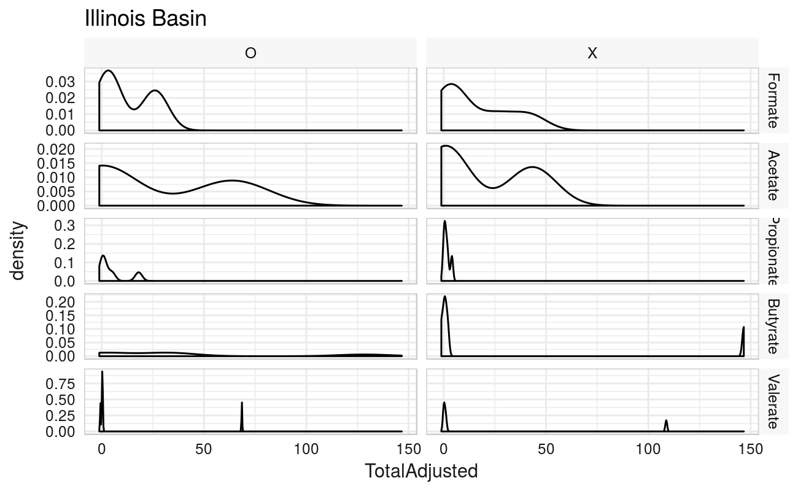
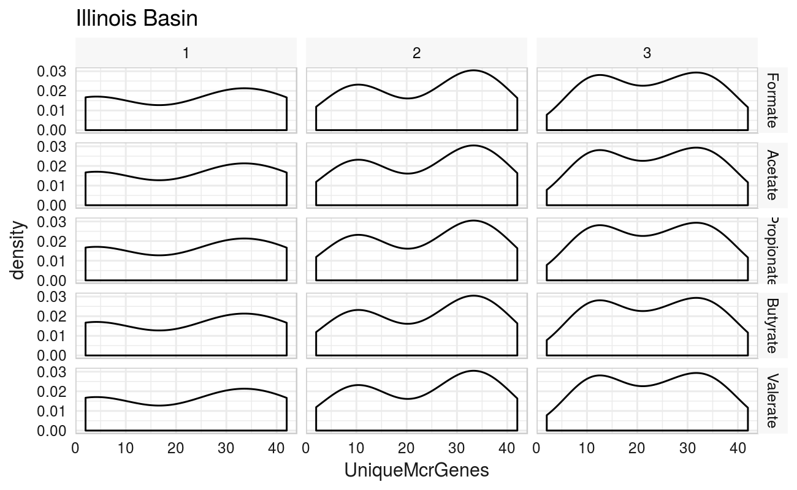
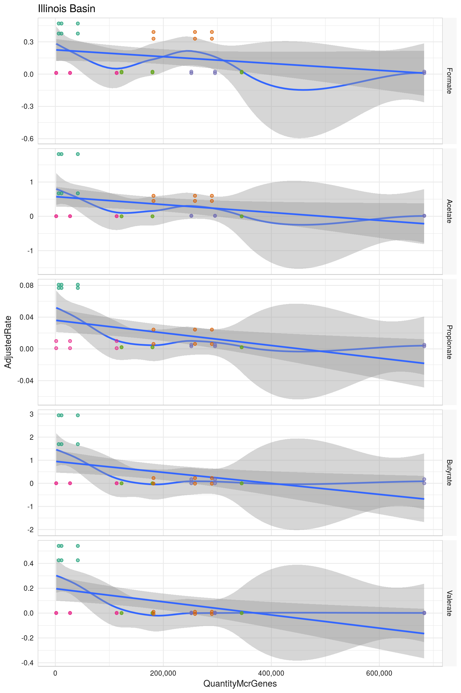
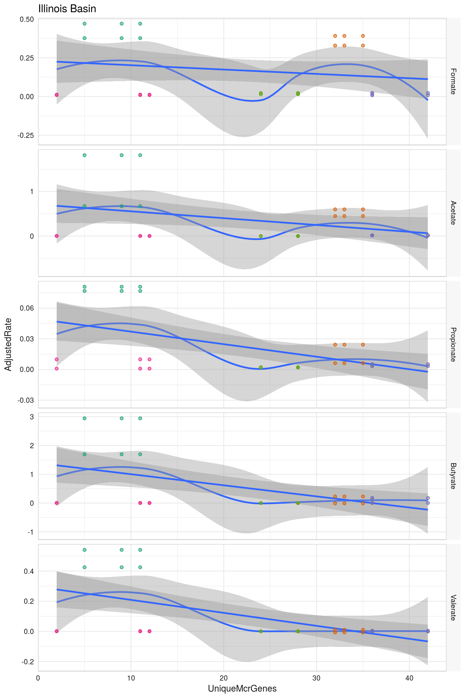
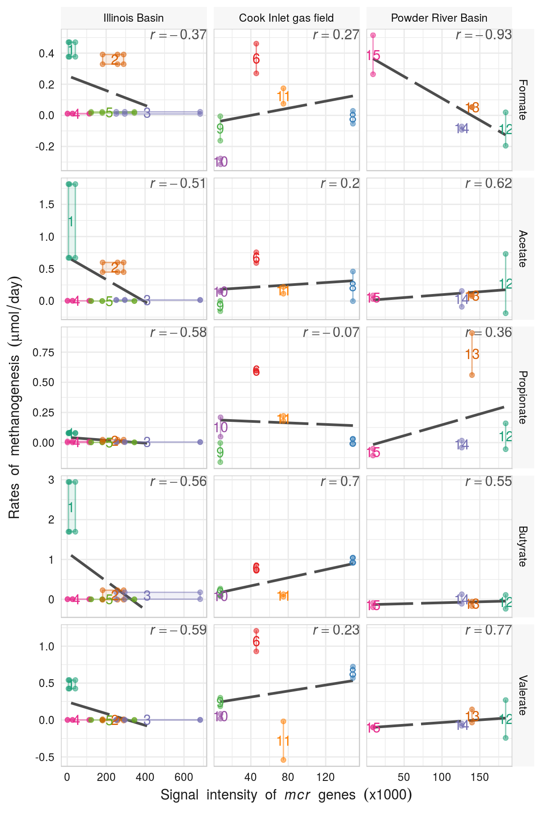
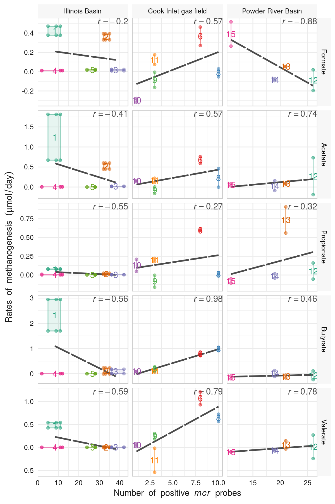

<!-- rmarkdown v1 -->
Graphs of MCR vs Methane Production Relationship
=================================================
This report looks at the relationship between MCR genes and Adjusted Total Methane Production

<!--  Set the working directory to the repository's base directory; this assumes the report is nested inside of two directories.-->


<!-- Set the report-wide options, and point to the external code file. -->

<!-- Load the packages.  Suppress the output when loading packages. --> 

```r
library(knitr)
library(plyr)
library(scales) #For formating values in graphs
library(RColorBrewer)
library(grid) #For graphing
library(ggplot2) #For graphing
# library(mgcv, quietly=TRUE) #For the Generalized Additive Model that smooths the longitudinal graphs.
#####################################
```

<!-- Load any Global functions and variables declared in the R file.  Suppress the output. --> 

```r
options(show.signif.stars=F) #Turn off the annotations on p-values
options(stringsAsFactors=FALSE) #By default, character/string variables will NOT be automatically converted to factors.

pathInputLong <- "./Data/Derived/AllBasinsLong.csv"
pathInputWide <- "./Data/Derived/AllBasinsWide.csv"

basinOrder <- c("Illinois Basin", "Cook Inlet gas field", "Powder River Basin")
substrateOrder <- c("Formate", "Acetate", "Propionate", "Butyrate", "Valerate")
sitesToDrop <- c(7, 16, 17)

ReportTheme <- theme_bw() +
  theme(axis.ticks.length = grid::unit(0, "cm")) +
  theme(axis.text = element_text(color="gray40")) +
  theme(axis.title = element_text(color="gray40")) +
  theme(panel.border = element_rect(color="gray80")) +
  theme(axis.ticks = element_line(color="gray80")) +
  theme(strip.background=element_rect(color=NA, fill="gray95"))
#####################################
```

<!-- Declare any global functions specific to a Rmd output.  Suppress the output. --> 


<!-- Load the datasets.   -->

```r
# 'ds' stands for 'datasets'
dsLong <- read.csv(pathInputLong)
dsWide <- read.csv(pathInputWide)
# sapply(dsWide, class)

#####################################
```

<!-- Tweak the datasets.   -->

```r
#Drop the sites without microarray data
dsLong <- dsLong[!(dsLong$Site %in% sitesToDrop), ]
dsWide <- dsWide[!(dsWide$Site %in% sitesToDrop), ]

#Reorder the substrates and basins.  The default alphabetical order isn't the most intuitive
dsLong$Basin <- factor(dsLong$Basin, levels=basinOrder)
dsWide$Basin <- factor(dsWide$Basin, levels=basinOrder)
dsLong$Substrate <- factor(dsLong$Substrate, levels=substrateOrder)
dsWide$Substrate <- factor(dsWide$Substrate, levels=substrateOrder)

dsLongIllinois <- dsLong[dsLong$Basin=="Illinois Basin", ]
dsWideIllinois <- dsWide[dsWide$Basin=="Illinois Basin", ]

CalculateSiteRange <- function( d ) {
  data.frame(
    RateMin = min(d$AdjustedRate, na.rm=T),
    RateMax = max(d$AdjustedRate, na.rm=T),
    TotalAdjustedMin = min(d$TotalAdjusted, na.rm=T),
    TotalAdjustedMax = max(d$TotalAdjusted, na.rm=T),
    UniqueMcrGenesMin = min(d$UniqueMcrGenes, na.rm=T),
    UniqueMcrGenesMax = max(d$UniqueMcrGenes, na.rm=T),
    QuantityMcrGenesMin = min(d$QuantityMcrGenes, na.rm=T),
    QuantityMcrGenesMax = max(d$QuantityMcrGenes, na.rm=T)
  )
}
dsSiteRange <- plyr::ddply(.data=dsLong, .variables=c("Basin", "Site", "Substrate"), CalculateSiteRange)

dsCorrelation <- plyr::ddply(dsWide, c("Basin", "Substrate"), summarize, 
                             CorrRateUnique=cor(RateMean, UniqueMean, use="pairwise.complete.obs"),
                             CorrRateQuantity=cor(RateMean, QuantityMean, use="pairwise.complete.obs"), 
                             CorrTotalUnique=cor(TotalAdjustedMean, UniqueMean, use="pairwise.complete.obs"),
                             CorrTotalQuantity=cor(TotalAdjustedMean, QuantityMean, use="pairwise.complete.obs"))
dsCorrelation$CorrRateUniquePretty <- paste0("italic(r)==", round(dsCorrelation$CorrRateUnique, 2))
dsCorrelation$CorrRateQuantityPretty <- paste0("italic(r)==", round(dsCorrelation$CorrRateQuantity, 2))
dsCorrelation$CorrTotalUniquePretty <- paste0("italic(r)==", round(dsCorrelation$CorrTotalUnique, 2))
dsCorrelation$CorrTotalQuantityPretty <- paste0("italic(r)==", round(dsCorrelation$CorrTotalQuantity, 2))

sitesIllinois <- sort(unique(dsLong[dsLong$Basin=="Illinois Basin", "Site"]))
sitesCook <- sort(unique(dsLong[dsLong$Basin=="Cook Inlet gas field", "Site"]))
sitesPowder <- sort(unique(dsLong[dsLong$Basin=="Powder River Basin", "Site"]))

paletteSiteDark <- c(RColorBrewer::brewer.pal(n=length(sitesIllinois), "Dark2"), RColorBrewer::brewer.pal(n=length(sitesCook), "Set1"), RColorBrewer::brewer.pal(n=length(sitesPowder), "Dark2"))
names(paletteSiteDark) <- c(sitesIllinois, sitesCook, sitesPowder)

paletteSiteLight <- grDevices::adjustcolor(paletteSiteDark, alpha.f=.5)
names(paletteSiteLight) <- c(sitesIllinois, sitesCook, sitesPowder)

#####################################
```

## Notes


# Marginals

```r
ggplot(dsLongIllinois, aes(x=TotalAdjusted)) + 
  geom_density() +
  facet_grid(Substrate~IncubationReplicate, scales="free_y") +
  ReportTheme +
  labs(title="Illinois Basin")
```



```r
ggplot(dsLongIllinois, aes(x=AdjustedRate)) + 
  geom_density() +
  facet_grid(Substrate~IncubationReplicate, scales="free_y") +
  ReportTheme +
  labs(title="Illinois Basin")
```


```r
ggplot(dsLongIllinois, aes(x=QuantityMcrGenes)) + 
  geom_density() +
  facet_grid(Substrate~MicroarraryReplicate, scales="free_y") +
  ReportTheme +
  labs(title="Illinois Basin")
```


```r
ggplot(dsLongIllinois, aes(x=UniqueMcrGenes)) + 
  geom_density() +
  facet_grid(Substrate~MicroarraryReplicate, scales="free_y") +
  ReportTheme +
  labs(title="Illinois Basin")
```



```r
#####################################
```

# Scatterplots
The first pair scatterplot matrices are for the *quantity* of genes, while the second pair is the count of *unique* genes.  Within each pair, the first scatterplot matrix has all replicates (2 incubation and 3 microarray replications per site), while the second within each pair shows a site's average across the replicates.



The these scatterplots combine the site means, with the individual replicate measurements.  The rectangles show the range for each Substrate-by-Site group of measurements.  In these two graphs, the **total** methane produced is shown.


|Basin                |Substrate  | CorrRateUnique| CorrRateQuantity| CorrTotalUnique| CorrTotalQuantity|
|:--------------------|:----------|--------------:|----------------:|---------------:|-----------------:|
|Illinois Basin       |Formate    |     -0.1980670|       -0.3652134|      -0.0153841|        -0.2110309|
|Illinois Basin       |Acetate    |     -0.4133581|       -0.5084354|      -0.2047249|        -0.3682843|
|Illinois Basin       |Propionate |     -0.5498238|       -0.5826815|      -0.6929801|        -0.6885130|
|Illinois Basin       |Butyrate   |     -0.5553904|       -0.5612917|      -0.4907994|        -0.4975343|
|Illinois Basin       |Valerate   |     -0.5851378|       -0.5878110|      -0.5871181|        -0.5894805|
|Cook Inlet gas field |Formate    |      0.5709074|        0.2731117|       0.6506798|         0.3043729|
|Cook Inlet gas field |Acetate    |      0.5702024|        0.2017605|       0.9186390|         0.6106309|
|Cook Inlet gas field |Propionate |      0.2725748|       -0.0720302|       0.4597091|        -0.0450702|
|Cook Inlet gas field |Butyrate   |      0.9834206|        0.7040071|       0.9777493|         0.6584533|
|Cook Inlet gas field |Valerate   |      0.7887965|        0.2272970|       0.8078082|         0.2692478|
|Powder River Basin   |Formate    |     -0.8812508|       -0.9343846|      -0.8730939|        -0.8288320|
|Powder River Basin   |Acetate    |      0.7354591|        0.6243768|       0.3606212|         0.3638370|
|Powder River Basin   |Propionate |      0.3246438|        0.3563692|       0.3910241|         0.4169247|
|Powder River Basin   |Butyrate   |      0.4555943|        0.5487025|      -0.3875952|        -0.3042464|
|Powder River Basin   |Valerate   |      0.7757310|        0.7652107|       0.1108650|         0.1559906|

In these two graphs, the **rate** of methane produced is shown.



# Questions
## Unanswered Questions
 1. - - - 
 
## Answered Questions
 1. - - - 
 
# Session Information
For the sake of documentation and reproducibility, the current report was build on a system using the following software.


```
Report created by wibeasley at 2017-02-24, 23:07 -0600
```

```
R version 3.3.1 (2016-06-21)
Platform: x86_64-pc-linux-gnu (64-bit)
Running under: Ubuntu 16.04.2 LTS

locale:
 [1] LC_CTYPE=en_US.UTF-8       LC_NUMERIC=C               LC_TIME=en_US.UTF-8        LC_COLLATE=en_US.UTF-8    
 [5] LC_MONETARY=en_US.UTF-8    LC_MESSAGES=en_US.UTF-8    LC_PAPER=en_US.UTF-8       LC_NAME=C                 
 [9] LC_ADDRESS=C               LC_TELEPHONE=C             LC_MEASUREMENT=en_US.UTF-8 LC_IDENTIFICATION=C       

attached base packages:
[1] grid      stats     graphics  grDevices utils     datasets  methods   base     

other attached packages:
[1] ggplot2_2.2.1      RColorBrewer_1.1-2 scales_0.4.1       plyr_1.8.4         knitr_1.15.1      

loaded via a namespace (and not attached):
 [1] Rcpp_0.12.9      assertthat_0.1   gtable_0.2.0     magrittr_1.5     evaluate_0.10    highr_0.6       
 [7] stringi_1.1.2    reshape2_1.4.2   lazyeval_0.2.0   labeling_0.3     tools_3.3.1      stringr_1.2.0   
[13] munsell_0.4.3    colorspace_1.3-2 tibble_1.2      
```
