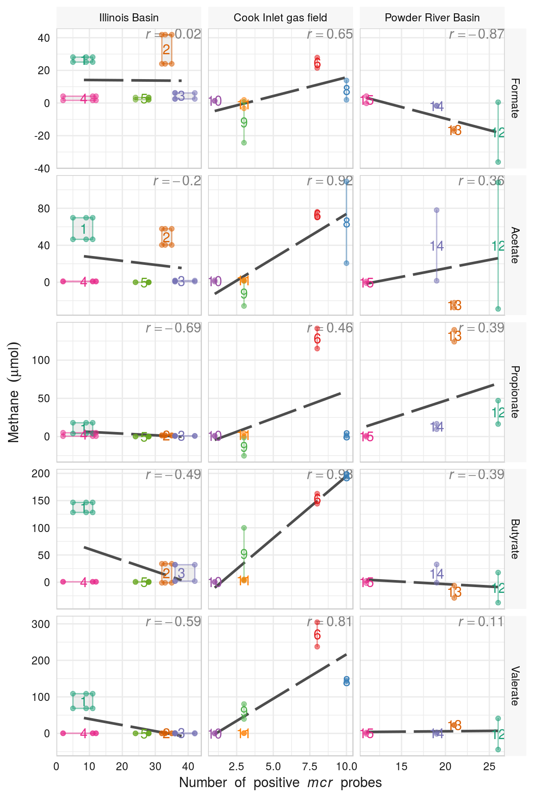

Welcome ot the code repository for the [article](https://academic.oup.com/femsec/article-abstract/doi/10.1093/femsec/fix040/3078548/Elucidation-of-the-methanogenic-potential-from?redirectedFrom=fulltext).

## Elucidation of the methanogenic potential from coalbed microbial communities amended with volatile fatty acids

[Christopher N. Lyles](https://sciences.nsula.edu/contact-usfaculty/)[1](http://mpbio.ou.edu/),
[Victoria A. Parisi](https://www.linkedin.com/in/victoria-parisi-4a64437/)[1](http://mpbio.ou.edu/),
[William H. Beasley](http://scholar.google.com/citations?user=ffsJTC0AAAAJ&hl=en)[3](http://howardliveoak.com/)
[Joy D. Van Nostrand](http://ieg.ou.edu/mediawiki/index.php?title=IEG_Members:Joy_Van_Nostrand)[1](http://mpbio.ou.edu/),[2](http://ieg.ou.edu/)
[Jizhong Zhou](http://ieg.ou.edu/people/jizhongzhou.html)[1](http://mpbio.ou.edu/),[2](http://ieg.ou.edu/)
[Joseph M. Suflita](http://mpbio.ou.edu/joseph-m-sulfita-ph-d)[1](http://mpbio.ou.edu/) (2017). **[Elucidation of the methanogenic potential from coalbed microbial communities amended with volatile fatty acids](https://academic.oup.com/femsec/article-abstract/doi/10.1093/femsec/fix040/3078548/Elucidation-of-the-methanogenic-potential-from?redirectedFrom=fulltext)**. [*FEMS Microbiology Ecology*](https://academic.oup.com/femsec), 93.  doi: https://doi.org/10.1093/femsec/fix040.

Organization 1: [Department of Microbiology and Plant Biology](http://mpbio.ou.edu/), and the [Institute for Energy and the Environment](http://vpr-norman.ou.edu/centers-institutes/list/ou-institute-energy-and-environment), Norman, OK; Organization 2: [Institute for Environmental Genomics](http://ieg.ou.edu/), [University of Oklahoma](http://www.ou.edu/), Norman, OK; Organization 3: [Howard Live Oak, LLC](http://howardliveoak.com/), Norman, OK.

(Note: Christopher Lyles is now an Assistant Professor of Biology at [Northwestern State University](https://biology.nsula.edu/)).

## Article Abstract
>The potential for modern coalfield methanogenesis was assessed using formation water from the Illinois Basin, Powder River Basin, and Cook Inlet gas field as inocula for nutrient-replete incubations amended with C1-C5 fatty acids as presumed intermediates formed during anaerobic coal biodegradation. Instead of the expected rapid mineralization of these substrates, methanogenesis was inordinately slow (∼1 μmol•day−1), following long lag periods (>100 day), and methane yields typically did not reach stoichiometrically expected levels. However, a gene microarray confirmed the potential for a wide variety of microbiological functions, including methanogenesis, at all sites. The Cook Inlet incubations produced methane at a relatively rapid rate when amended with butyrate (*r* = 0.98; *p* = 0.001) or valerate (*r* = 0.84; *p* = 0.04), a result that significantly correlated with the number of positive mcr gene sequence probes from the functional gene microarray and was consistent with the in situ detection of C4-C5 alkanoic acids. This finding highlighted the role of syntrophy for the biodegradation of the softer lignite and subbituminous coal in this formation, but methanogenesis from the harder subbituminous and bituminous coals in the other fields was less apparent. We conclude that coal methanogenesis is probably not limited by the inherent lack of metabolic potential, the presence of alternate electron acceptors, or the lack of available nutrients, but more likely restricted by the inherent recalcitrance of the coal itself.

> Keywords:
coalbed methane; coal basin; metabolite analysis; alkanoic acids; microbial communities; functional gene array

## Selected Figures from Manuscript
The following figures can be reproduced from the datasets and analytical code in this repository. These are low-resolution versions; the high-resolution versions can be found in the [article](https://academic.oup.com/femsec/article-abstract/doi/10.1093/femsec/fix040/3078548/Elucidation-of-the-methanogenic-potential-from) or in the [`./Analysis/`](./Analysis/) directory.

#### Figure 2

#### Figure 5

#### Figure 6

